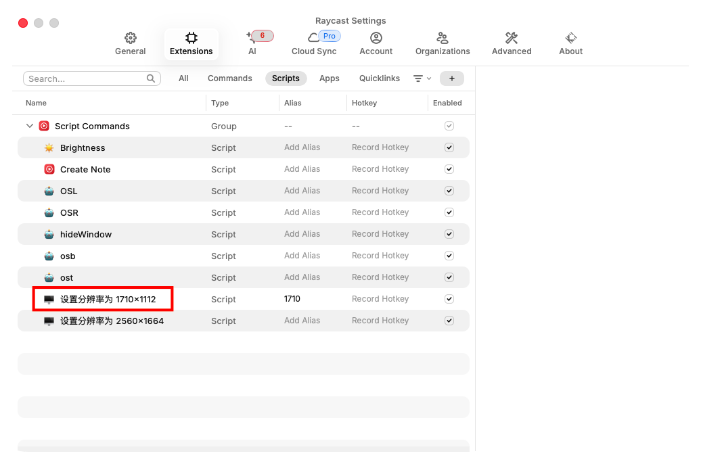
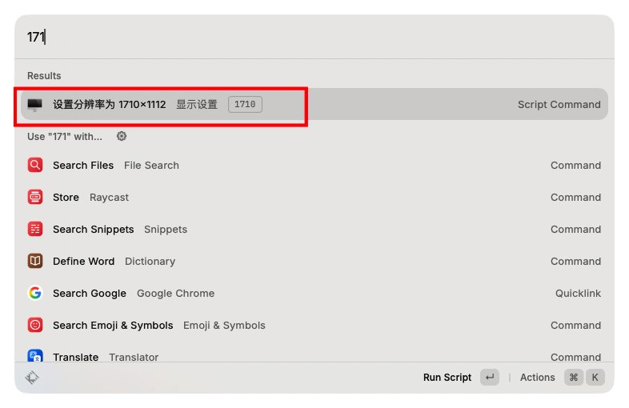

# 使用raycast脚本快速调整MAC分辨率

# 需求：
MacBook Air M2，字体在分辨率为1710x1112、2560x1664下才会显示锐利不模糊。
工作学习中，有时候希望电脑软件显示内容多一点，用大分辨率；希望字体大一点，对眼睛好一点，或者让别人也能看清电脑内容。需要切换电脑分辨率。
在MAC设置：苹果菜单 → 系统设置 → 显示器 → 用途 → 切换分辨率。切换比较慢。
我想结合raycast的脚本功能，快速切换屏幕分辨率。

# 方法
## 设置分辨率为 1710x1112的脚本内容
新建一个“1710 分辨率.sh“脚本文件，文件内容：
```
#!/bin/bash
# Required parameters:
# @raycast.schemaVersion 1
# @raycast.title 设置分辨率为 1710x1112
# @raycast.mode silent

# Optional parameters:
# @raycast.icon 🖥
# @raycast.packageName 显示设置

# Documentation:
# @raycast.description 使用 displayplacer 设置显示器分辨率
displayplacer "id:37D8832A-2D66-02CA-B9F7-8F30A301B230 res:1710x1112 scaling:on"
```

注意：
	•	displayplacer 是一个 macOS 工具，用来设置显示器分辨率和排列
        打开终端，依次输入以下代码
        ‘brew install displayplacer‘
        ‘displayplacer --version‘
        ‘displayplacer list‘
        在输出内容中找到你的MAC显示器的ID（Persistent screen id:），替换脚本最后一行我自己显示器的ID。
                Persistent screen id: 37D8832A-2D66-02CA-B9F7-8F30A301B230
                Contextual screen id: 1
                Serial screen id: s4251086178
                Type: MacBook built in screen
                Resolution: 2560x1664

## 使用
raycast软件，导入脚本库。
将‘1710 分辨率.sh‘文件放到一个文件夹；
在raycast的Extensions tab设置页面，添加这个文件夹

切换到脚本scripts Tab，能看到我们导入的脚本。

在raycast输入框，输入 1710，按enter调整分辨率成功：

---
